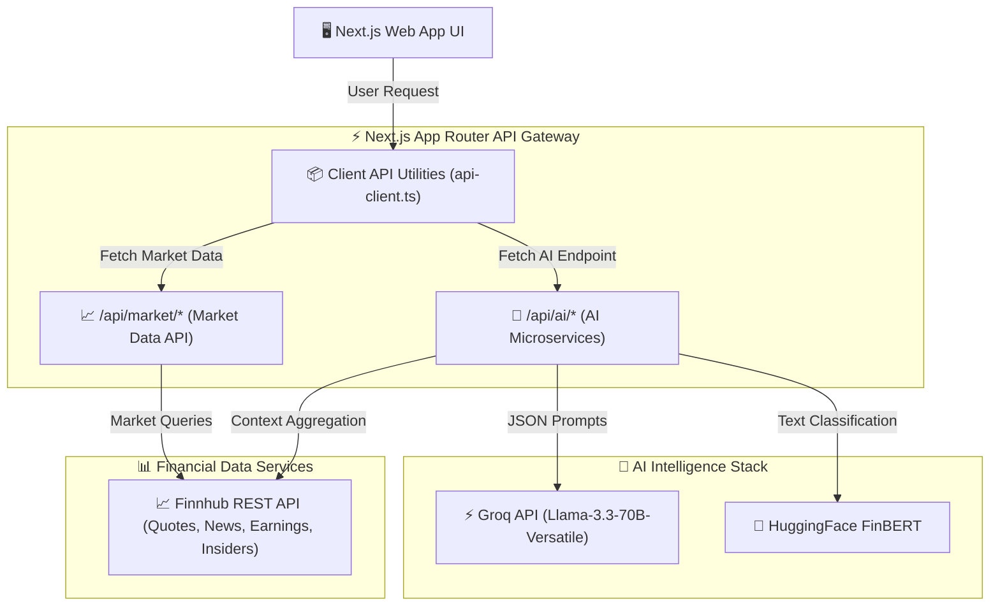

# ⚡ EdgeIQ — Next-Gen AI Market Intelligence & Trading Journal

<div align="center">


*An AI-powered financial market intelligence platform, sentiment analyzer, and smart trading journal built with Next.js 16, Llama 3.3 (Groq), ProsusAI FinBERT, and Finnhub Real-Time Market APIs.*

</div>

---

## 📐 Architecture Overview



---

## ✨ Core Capabilities

- 🤖 **FinBERT Financial Sentiment Engine**: Classifies market news and stock headlines using HuggingFace's `ProsusAI/finbert` NLP model with precision score metrics (`bullish`, `bearish`, `neutral`).
- ⚡ **Groq Llama-3.3 70B Synthesis**: Generates instant trade autopsies, daily market debriefs, pre-trade risk assessments, insider trading breakdowns, and earnings previews.
- 📈 **Real-Time Financial Data Pipeline**: Integrates Finnhub APIs for live stock quotes, market indices ticker tape, company metrics, insider transactions, options chains, and economic calendars.
- 📓 **Smart Trader Journal & Autopsy**: Logs trades with entry/exit parameters, strategy tags, and emotional metrics, running automated AI performance autopsies.
- 🎯 **Algorithmic Market Bias Radar**: Computes dynamic bias index aggregating macro news, sentiment scores, and momentum technical indicators.
- 📊 **Interactive Data Visualizations**: Custom financial charts powered by **Recharts** and smooth UI micro-animations powered by **Framer Motion**.
- 🎨 **Enterprise Glassmorphic UI**: Premium dark mode design tokens, responsive layout grid, dynamic modal debriefs, and customizable settings.

---

## 🚀 Quick Start

### 1. Prerequisites
Ensure you have **Node.js 18+** installed on your system.

### 2. Clone & Install Dependencies
```bash
git clone <repository-url>
cd edge
npm install
```

### 3. Configure Environment Variables
Create a `.env` file in the root directory:
```env
# Groq AI API Key (Llama 3.3 70B)
GROQ_API_KEY=your_groq_api_key_here

# HuggingFace Token (FinBERT Sentiment Inference)
HF_TOKEN=your_huggingface_token_here

# Finnhub Financial Data API Key
FINNHUB_API_KEY=your_finnhub_api_key_here
```

### 4. Run Development Server
```bash
npm run dev
```
Open [http://localhost:3000](http://localhost:3000) in your browser to launch EdgeIQ.

---

<details>
<summary>📂 <strong>Detailed Directory Structure & Architecture</strong></summary>

```
edge/
├── public/                 # Static assets and icons
├── src/
│   ├── app/                # Next.js 16 App Router pages & API routes
│   │   ├── api/
│   │   │   ├── ai/         # 12 AI Microservice endpoints (Groq & FinBERT)
│   │   │   │   ├── daily-debrief/
│   │   │   │   ├── earnings-preview/
│   │   │   │   ├── event-explainer/
│   │   │   │   ├── insider-analysis/
│   │   │   │   ├── journal-summary/
│   │   │   │   ├── market-bias/
│   │   │   │   ├── options-explainer/
│   │   │   │   ├── pre-trade/
│   │   │   │   ├── research/
│   │   │   │   ├── sentiment/
│   │   │   │   ├── signals/
│   │   │   │   └── trade-autopsy/
│   │   │   └── market/     # 12 Finnhub Market Data proxy endpoints
│   │   │       ├── bias/
│   │   │       ├── earnings/
│   │   │       ├── earnings-calendar/
│   │   │       ├── economic-calendar/
│   │   │       ├── fundamentals/
│   │   │       ├── indices/
│   │   │       ├── insiders/
│   │   │       ├── news/
│   │   │       ├── options/
│   │   │       ├── profile/
│   │   │       ├── quote/
│   │   │       └── watchlist/
│   │   ├── calendar/       # Economic & Earnings Calendar page
│   │   ├── dashboard/      # Main Dashboard layout & analytics
│   │   ├── journal/       # Trader Journal & Autopsy page
│   │   ├── market-bias/   # Market Bias & Signals Radar page
│   │   ├── research/      # Company Research & Insider Intelligence page
│   │   ├── sentiment/     # Real-time FinBERT Sentiment Analyzer page
│   │   ├── settings/      # User Preferences & API Key configuration page
│   │   ├── globals.css    # Tailwind CSS & glassmorphic custom theme
│   │   ├── layout.tsx     # Root layout with providers & navigation
│   │   └── page.tsx       # Landing page / Main Dashboard entry
│   ├── components/
│   │   ├── dashboard/     # Daily Debrief, Ticker Tape, Trade Modals
│   │   ├── layout/        # Navbar, Sidebar, Footer, Header components
│   │   ├── providers/     # Theme Provider & App Context
│   │   ├── research/      # Financial metric charts & insider cards
│   │   └── ui/            # UI components (Buttons, Cards, Inputs, Badges)
│   └── lib/
│       ├── api-client.ts  # Client-side API fetch wrappers
│       ├── finbert.ts     # HuggingFace FinBERT sentiment classifier client
│       ├── finnhub.ts     # Finnhub API integration client
│       ├── groq.ts        # Groq Llama-3.3 70B JSON inference helper
│       └── utils.ts       # Utility functions & formatting helpers
├── next.config.mjs        # Next.js configuration
├── tailwind.config.ts     # Tailwind CSS theme configuration
├── tsconfig.json          # TypeScript compiler configuration
└── package.json           # Project metadata & dependencies
```

</details>

---

<details>
<summary>🔌 <strong>Complete API Endpoint Reference</strong></summary>

### 🤖 AI Microservice Endpoints (`/api/ai/*`)

| Endpoint | Method | Description | Primary Engine |
| :--- | :---: | :--- | :---: |
| `/api/ai/daily-debrief` | `POST` | Synthesizes daily market movers & trade summaries into an executive debrief | Groq Llama 3.3 70B |
| `/api/ai/sentiment` | `POST` | Performs NLP financial sentiment analysis on news headlines | HuggingFace FinBERT |
| `/api/ai/pre-trade` | `POST` | Evaluates trade entry risk, position sizing, and R:R parameters | Groq Llama 3.3 70B |
| `/api/ai/trade-autopsy` | `POST` | Generates deep post-mortem analysis for winning & losing trades | Groq Llama 3.3 70B |
| `/api/ai/market-bias` | `POST` | Aggregates technical indicators & macro news to calculate market bias | Groq Llama 3.3 70B |
| `/api/ai/insider-analysis` | `POST` | Analyzes insider buying/selling patterns for institutional signal | Groq Llama 3.3 70B |
| `/api/ai/earnings-preview` | `POST` | Provides predictive insights & consensus expectations ahead of earnings | Groq Llama 3.3 70B |
| `/api/ai/event-explainer` | `POST` | Explains macroeconomic events (CPI, FOMC, Fed Rate decisions) | Groq Llama 3.3 70B |
| `/api/ai/journal-summary` | `POST` | Analyzes trader performance metrics, behavioral patterns, & emotional triggers | Groq Llama 3.3 70B |
| `/api/ai/options-explainer` | `POST` | Decodes complex options greeks & strategy risk profiles | Groq Llama 3.3 70B |
| `/api/ai/research` | `POST` | Generates comprehensive fundamental & qualitative research reports | Groq Llama 3.3 70B |
| `/api/ai/signals` | `POST` | Identifies high-probability trade setups & confluence alerts | Groq Llama 3.3 70B |

### 📈 Market Data Proxy Endpoints (`/api/market/*`)

| Endpoint | Method | Description | Data Provider |
| :--- | :---: | :--- | :---: |
| `/api/market/quote` | `GET` | Real-time price quotes, day high/low, & price change metrics | Finnhub API |
| `/api/market/indices` | `GET` | Live index data for major market benchmarks (SPY, QQQ, DIA, IWM) | Finnhub API |
| `/api/market/news` | `GET` | Latest market-wide & ticker-specific financial news stream | Finnhub API |
| `/api/market/fundamentals` | `GET` | Fundamental financial ratios, P/E, EPS, Market Cap, & margins | Finnhub API |
| `/api/market/insiders` | `GET` | C-suite & institutional insider transaction filings | Finnhub API |
| `/api/market/earnings` | `GET` | Historical earnings surprises & EPS beats/misses | Finnhub API |
| `/api/market/earnings-calendar` | `GET` | Upcoming earnings releases calendar for tracked symbols | Finnhub API |
| `/api/market/economic-calendar` | `GET` | Macroeconomic event calendar (Fed meetings, CPI, PPI, NFP) | Finnhub API |
| `/api/market/options` | `GET` | Complete options chain data & open interest distribution | Finnhub API |
| `/api/market/profile` | `GET` | Company profile, industry sector, description, & executive details | Finnhub API |
| `/api/market/bias` | `GET` | Calculated market bias metrics across multiple timeframes | Internal Engine |
| `/api/market/watchlist` | `GET / POST` | Manages active ticker watchlists and user preferences | Internal Engine |

</details>

---

<details>
<summary>🔑 <strong>Environment Configuration & API Keys</strong></summary>

### Key Requirements

| Variable Name | Required | Provider | Description |
| :--- | :---: | :--- | :--- |
| `GROQ_API_KEY` | **Yes** | [Groq Cloud](https://console.groq.com/) | Access to `llama-3.3-70b-versatile` ultra-fast LLM inference. |
| `HF_TOKEN` | **Yes** | [HuggingFace](https://huggingface.co/settings/tokens) | Authorization token for `ProsusAI/finbert` text classification. |
| `FINNHUB_API_KEY` | **Yes** | [Finnhub.io](https://finnhub.io/) | Free/Premium API key for real-time market data & news feed. |

</details>

---

<details>
<summary>🛠️ <strong>Production Deployment & Building</strong></summary>

### Local Production Build
```bash
# Generate optimized Next.js production build
npm run build

# Start production server
npm start
```

### Deploying to Vercel
The easiest way to deploy EdgeIQ is using the Vercel platform:
1. Push your repository to GitHub / GitLab.
2. Import the project into [Vercel](https://vercel.com/new).
3. Set the environment variables (`GROQ_API_KEY`, `HF_TOKEN`, `FINNHUB_API_KEY`) in the Vercel Dashboard.
4. Click **Deploy**.

</details>